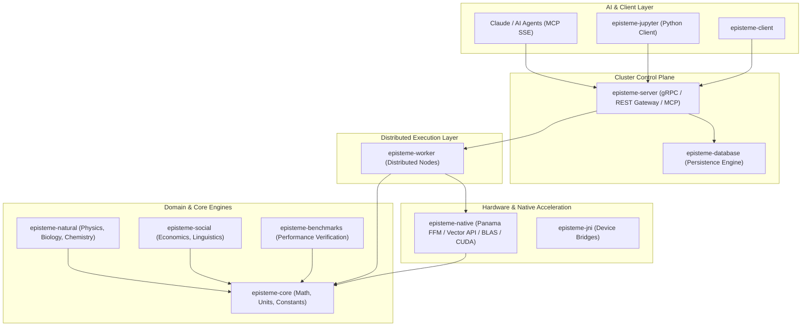

# Episteme Architecture & System Design

Episteme is an enterprise-grade, bare-metal scientific computing framework and distributed computing platform designed for the Java(TM) platform (Java 21 LTS & Java 25 EA). It provides hardware-accelerated linear algebra, domain-specific multi-physics simulations, distributed cluster orchestration, and Model Context Protocol (MCP) tool bindings for AI agents.

---

## 1. High-Level Modular Topology

---

## 2. Module Responsibilities

### [episteme-core](file:///c:/Silvere/Encours/Developpement/Episteme/episteme-core)
The fundamental kernel of Episteme:
- **Mathematics**: Algebraic structures (Rings, Fields, Vector Spaces), Matrix/Tensor interfaces, Symbolic calculus, Numerical optimization, High-precision arithmetic.
- **Physical Quantities**: Dimensionally safe measurement units (JSR-385) and international standard physical constants (CODATA).
- **Core Technical Foundation**: Provider discovery, memory management, safe XML parsing (`SecureXMLFactory`), properties loaders.

### [episteme-native](file:///c:/Silvere/Encours/Developpement/Episteme/episteme-native)
Bare-metal acceleration using Java Foreign Function & Memory API (Project Panama, JEP 454) and SIMD Vector API (JEP 448):
- Zero-overhead downcalls to OpenBLAS, LAPACK, MKL, and custom C++/CUDA kernels.
- Off-heap native memory allocation managed deterministically via `Arena.ofConfined()` and `Arena.ofShared()`.
- Auto-vectorized image processing, matrix algebra, and physics collision detection.

### [episteme-server](file:///c:/Silvere/Encours/Developpement/Episteme/episteme-server)
The central cluster coordinator and API gateway:
- **gRPC Service Scheduler**: Priority-based task queuing (CRITICAL, HIGH, NORMAL, LOW), starvation prevention, and worker health tracking.
- **Model Context Protocol (MCP)**: Server-Sent Events (SSE) and JSON-RPC 2.0 endpoint allowing LLMs (e.g. Claude Desktop) to execute scientific tools, run simulations, and query datasets directly.
- **REST Gateway**: Spring Boot REST API for monitoring, task submission, and health probes (`/api/health`).
- **Resilience Engine**: Checkpoint management with local NVMe and S3/MinIO cloud persistence.

### [episteme-worker](file:///c:/Silvere/Encours/Developpement/Episteme/episteme-worker)
High-throughput compute daemon:
- Subscribes to tasks from `episteme-server` via streaming gRPC.
- Executes tasks across available hardware backends (CPU Vector API, Panama FFM BLAS, OpenCL, CUDA).
- Reports task execution progress and checkpoint states back to the coordinator.

### [episteme-natural](file:///c:/Silvere/Encours/Developpement/Episteme/episteme-natural)
Multi-disciplinary physical and life science engines:
- **Biology**: Genomics FASTA/FASTQ streaming, CRISPR Cas9/Cas12 target finding, phylogenetic tree modeling.
- **Chemistry**: CML (Chemical Markup Language) parsers, periodic table dynamics, reaction balancing.
- **Physics**: N-Body gravitational simulator, spintronics, lattice Boltzmann fluid dynamics, collision physics.

### [episteme-social](file:///c:/Silvere/Encours/Developpement/Episteme/episteme-social)
Socio-economic, geographic, and linguistic modeling:
- **Economics**: Financial portfolio risk models, market simulations, historical currency conversions.
- **Linguistics**: Phonetic transcriptions, TigerXML corpus parsing, natural language tokenizers.
- **Geography**: GML geospatial mapping and migration flow analytics.

### [episteme-jupyter](file:///c:/Silvere/Encours/Developpement/Episteme/episteme-jupyter)
Python SDK client enabling interactive scientific research and distributed job dispatching directly from Jupyter Notebooks.

---

## 3. Key Architectural Patterns

1. **Deterministic Off-Heap Memory Safety**: Zero GC overhead during massive matrix operations by scoping native buffers in Panama arenas.
2. **Pluggable Backend Providers**: Seamless runtime switching between Native BLAS, SIMD CPU, CUDA, and Java standard fallbacks via `ProviderSelector`.
3. **Defense-in-Depth Security**: JWT-based RBAC, path traversal sanitization, and isolated worker communication channels.
4. **Resilient Distributed Scheduling**: Automatic task checkpointing and graceful worker recovery.
